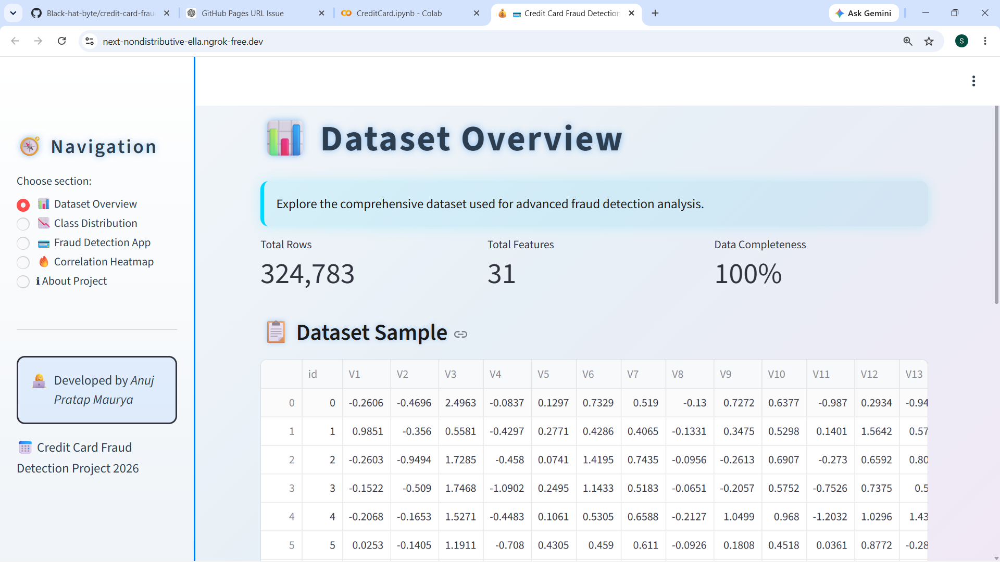
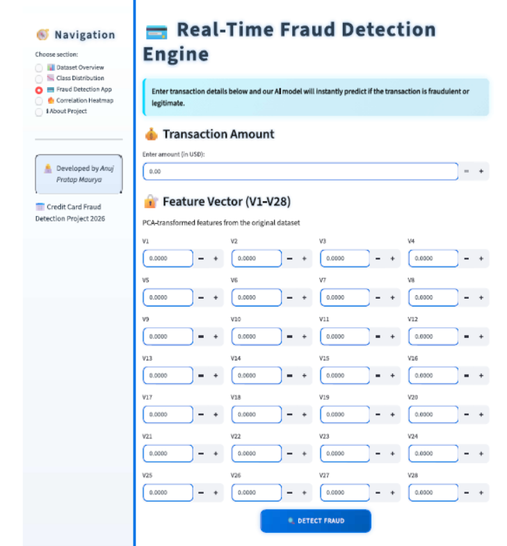
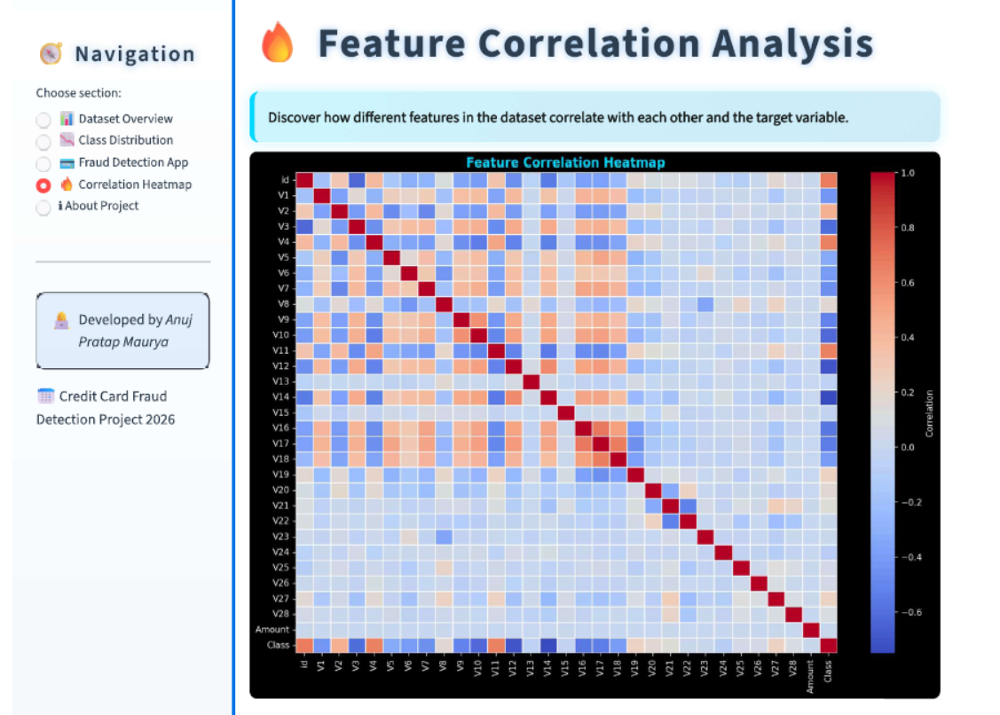

# 💳 Credit Card Fraud Detection System
> A real-time ML-powered system that identifies fraudulent credit card transactions, backed by an interactive Streamlit dashboard.

---

## 🚀 Live Demo
Deployed using Streamlit and ngrok directly on Google Colab — no local setup needed.

---

## 📌 Why This Project?
Financial fraud is one of the biggest threats in today's digital payment ecosystem. The real challenge here wasn't just building a model — it was handling **severely imbalanced data** where fraudulent transactions made up less than 0.3% of the entire dataset (only 148 fraud cases out of 49,456 transactions). This project addresses that head-on with a complete end-to-end pipeline.

---

## 📊 Dataset Details
- **Source:** Kaggle — `creditcard_2023.csv`
- **Size:** 49,605 transactions
- **Input Features:** 28 PCA-transformed variables (V1–V28) along with transaction Amount
- **Label:** Class column — `0` for Legitimate, `1` for Fraudulent
- **Key Challenge:** Extreme class imbalance (~0.3% fraud rate)

---

## ⚙️ How It Works
1. **Exploratory Data Analysis** — Visualized distributions, correlations, and class imbalance
2. **Data Preprocessing** — Applied StandardScaler & SimpleImputer; used stratified 80-20 split
3. **Handling Imbalance** — Used oversampling to bring fraud ratio up to 42.63% (284,315 legit vs 211,287 fraud samples)
4. **Model Building** — Trained and compared Logistic Regression and Random Forest classifiers
5. **Performance Evaluation** — Assessed using Confusion Matrix and detailed Classification Report
6. **Dashboard Deployment** — Wrapped everything in a Streamlit app, exposed via ngrok

---

## 🤖 Model Comparison
| Model | Accuracy | F1-Score (Fraud class) |
|-------|----------|------------------------|
| Logistic Regression | 99.82% | 0.72 |
| **Random Forest** ✅ | **99.92%** | **0.88** |

> **Final Model:** Random Forest — exported as `fraud_detection_model.pkl` using Joblib

---

## 🖥️ Dashboard Highlights
- 📊 Full dataset summary and statistics
- 📈 Visual breakdown of fraud vs legitimate transactions
- 🔥 Feature correlation heatmap
- 🔍 Live transaction checker — enter values and get instant predictions
- 🔒 No data stored or logged — completely privacy-safe

- 

---

## 🖥️ Dashboard Screenshots

### Dataset Overview

### Class Distribution

### Real-time Fraud Detection App

### Correlation Heatmap

## 🛠️ Tech Stack
| Category | Tools Used |
|----------|------------|
| Language | Python |
| ML Framework | Scikit-learn |
| Data Handling | Pandas, NumPy |
| Visualizations | Matplotlib, Seaborn |
| Web Dashboard | Streamlit |
| Deployment | ngrok + Google Colab |
| Model Export | Joblib (`.pkl` format) |

---

## 👨‍💻 Developed By
**Anuj Pratap Maurya**  
